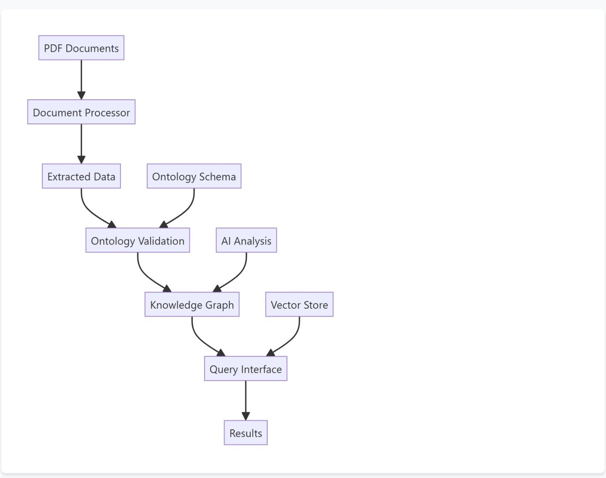
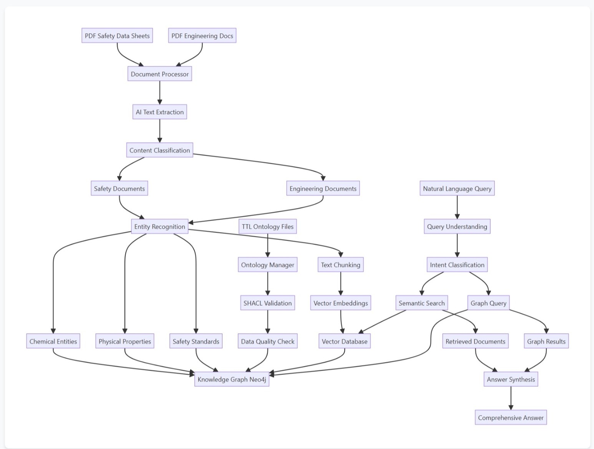
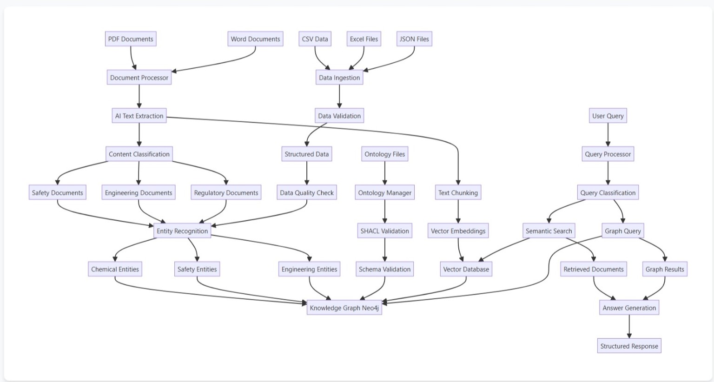
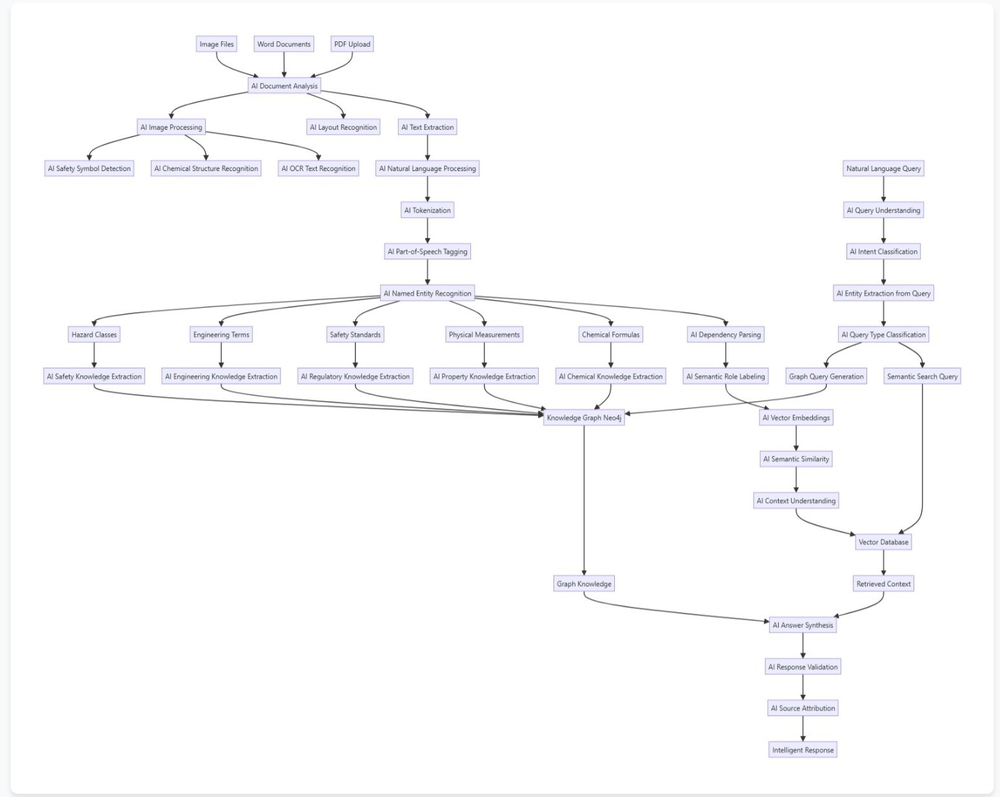
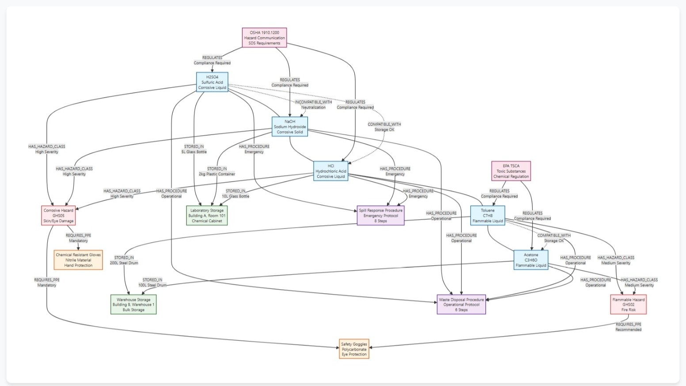

# HazardSafe-KG: Unified Safety Analysis Platform

A comprehensive software platform for structured analysis and processing of safety-relevant technical documents in the field of hazardous substances. The platform integrates ontology management, knowledge graph generation, retrieval-augmented generation, and validation systems for comprehensive safety analysis.

## 📹 Platform Overview


*Complete platform functionality demonstration including Ontology Management, Knowledge Graph, RAG System, and Validation Engine*

## 🏗️ System Architecture & Flowcharts

The HazardSafe-KG platform features a modular architecture with integrated components for comprehensive safety analysis. The system architecture is available as an interactive flowchart within the web application. 


*Interactive system workflows and component interactions showing data flow and AI processing pipelines*

### Main Flow


### Detailed Flow


### Data Flow


### AI Components


### Example Knowledge Graph


## 🚀 Features

### 🔍 **NLP & RAG System**
- **Document Upload & Processing**: Support for PDF, DOCX, and TXT files
- **Intelligent Question Answering**: AI-powered responses based on uploaded documents
- **Entity Recognition**: Extract chemicals, hazards, equipment, and safety information
- **Relationship Extraction**: Identify connections between entities
- **Sentiment Analysis**: Analyze text sentiment for safety assessments
- **Model Configuration**: Choose from multiple LLM, embedding, and retriever models
- **Query History**: Track and review previous interactions

### 🏗️ **Ontology Management**
- **SHACL Validation**: Shape-based data validation
- **Ontology Import/Export**: Support for RDF, OWL, and JSON-LD formats
- **Visual Ontology Editor**: Interactive graph-based editing
- **Reasoning Engine**: Automated inference and consistency checking

### 🕸️ **Knowledge Graph**
- **Neo4j Integration**: Graph database for complex relationships
- **Interactive Visualization**: D3.js-powered graph exploration
- **Cypher Query Interface**: Direct graph querying capabilities
- **Relationship Mining**: Automated discovery of entity connections

### ✅ **Validation Engine**
- **Multi-format Validation**: CSV, JSON, and custom data validation
- **Compatibility Checking**: Substance-container compatibility verification
- **Chemical Formula Validation**: Molecular structure verification
- **Regulatory Compliance**: Safety standard validation

### 📊 **Quality Assessment**
- **Data Quality Metrics**: Completeness, accuracy, and consistency scoring
- **Quality Reports**: Detailed HTML reports with visualizations
- **Interactive Dashboard**: Real-time quality monitoring
- **Recommendations**: Automated improvement suggestions

## 🚀 Getting Started

### Prerequisites
- Python 3.8+
- FastAPI
- Uvicorn
- Neo4j (for production)
- Vector database (Pinecone, Weaviate, etc.)
- LLM API (OpenAI, Anthropic, etc.)

### Installation
```bash
# Clone the repository
git clone <repository-url>
cd HazardSafe-KG

# Install dependencies
pip install -r requirements.txt

# Set up environment variables
cp .env.example .env
# Edit .env with your configuration

# Run the application
python main.py
```

### Configuration
Create a `.env` file with the following variables:
```env
# Database
NEO4J_URI=bolt://localhost:7687
NEO4J_USER=neo4j
NEO4J_PASSWORD=password

# Vector Database
VECTOR_DB_URL=your_vector_db_url
VECTOR_DB_API_KEY=your_api_key

# LLM API
OPENAI_API_KEY=your_openai_key
ANTHROPIC_API_KEY=your_anthropic_key

# Application
DEBUG=True
SECRET_KEY=your_secret_key
```

## 🔧 Development

### Project Structure
```
HazardSafe-KG/
├── webapp/
│   ├── app.py              # Main FastAPI app
│   ├── ontology/
│   │   └── routes.py       # Ontology API routes
│   ├── kg/
│   │   └── routes.py       # Knowledge Graph API routes
│   ├── rag/
│   │   └── routes.py       # RAG API routes
│   ├── validation/
│   │   └── routes.py       # Validation API routes
│   ├── quality/
│   │   └── routes.py       # Quality assessment API routes
│   ├── static/
│   │   ├── css/
│   │   │   └── main.css    # Main styles
│   │   ├── js/
│   │   │   ├── main.js     # Common utilities
│   │   │   ├── ontology.js # Ontology management
│   │   │   └── kg.js       # Knowledge Graph visualization
│   │   └── reports/
│   │       └── quality/    # Generated quality reports
│   └── templates/
│       ├── index.html      # Main dashboard
│       ├── ontology/
│       │   └── index.html  # Ontology management UI
│       ├── kg/
│       │   └── index.html  # Knowledge Graph UI
│       ├── rag/
│       │   └── index.html  # RAG system UI
│       ├── validation/
│       │   └── index.html  # Validation UI
│       └── quality/
│           ├── index.html  # Quality assessment UI
│           └── dashboard.html # Quality dashboard
├── ontology/
│   └── src/                # Ontology source files
├── kg/
│   └── neo4j/              # Neo4j configuration
├── quality/
│   ├── metrics.py          # Quality metrics calculation
│   ├── reports.py          # Report generation
│   ├── utils.py            # Quality utilities
│   └── tests/              # Quality tests
├── ingestion/
│   └── haz_ingest.py       # Document ingestion
├── validation/
│   └── rules.py            # Safety validation rules
├── data/
│   └── quality/            # Quality configuration and data
├── tests/                  # Test suite
├── main.py                 # Application entry point
└── README.md              # This file
```

### Running Tests
```bash
# Run all tests
pytest

# Run specific module tests
pytest tests/test_ontology.py
pytest tests/test_kg.py
pytest tests/test_rag.py
```

### API Documentation
Once the application is running, visit:
- **Interactive API Docs**: http://localhost:8000/docs
- **ReDoc Documentation**: http://localhost:8000/redoc

## 🔒 Security & Authentication

### Current State
- Basic CORS configuration
- No authentication implemented
- Development mode enabled

### Planned Security Features
- JWT-based authentication
- Role-based access control
- API rate limiting
- Input validation and sanitization
- Audit logging

## 🚧 Roadmap

### Phase 1: Core Platform Foundation ✅ COMPLETED
- ✅ **FastAPI Backend**: Modular architecture with clean separation of concerns
- ✅ **Web Interface**: Modern, responsive UI with Bootstrap and custom styling
- ✅ **Ontology Management**: Complete UI for managing classes, properties, and relationships
- ✅ **Knowledge Graph Visualization**: Interactive D3.js graph with zoom, pan, and node interaction
- ✅ **RAG System Interface**: Document upload, query interface, and AI response display
- ✅ **Validation Engine**: SHACL-based validation with CSV and JSON data validation
- ✅ **System Architecture**: Interactive flowchart showing complete system components
- ✅ **Navigation & UX**: Consistent navigation across all pages with proper styling
- ✅ **Sample Data**: Comprehensive sample data for demonstration and testing
- ✅ **API Endpoints**: Full REST API for all modules with proper error handling

### Phase 2: Enhanced Features & Integration 🔄 IN PROGRESS

#### Phase 2A: Database & Storage Integration 📋 NEXT PRIORITY
- 📋 **Neo4j Database**: Set up production Neo4j instance with real data
- 📋 **Vector Database**: Choose and configure primary vector store (Pinecone/Weaviate/ChromaDB)
- 📋 **Data Import Pipeline**: Import real hazardous substance databases and safety documents
- 📋 **Embedding Models**: Integrate OpenAI/HuggingFace models for document processing
- 📋 **Knowledge Graph Schema**: Create comprehensive safety ontology with real entities

#### Phase 2B: AI & LLM Integration 📋 PLANNED
- 📋 **OpenAI Integration**: GPT-4 for safety recommendations and analysis
- 📋 **Anthropic Claude**: Risk assessment and compliance checking
- 📋 **Document Processing**: Advanced PDF/text extraction with AI
- 📋 **Semantic Search**: Vector-based document retrieval and similarity matching
- 📋 **Query Understanding**: Natural language to structured query conversion

#### Phase 2C: Advanced Validation & Compliance 📋 PLANNED
- 📋 **Real-time Validation**: Live data validation against safety standards
- 📋 **Regulatory Compliance**: Automated checking against chemical safety regulations
- 📋 **Custom Rules Engine**: User-defined validation rules and constraints
- 📋 **Quality Assurance**: Automated data quality checks and recommendations
- 📋 **Audit Trail**: Complete validation history and compliance reporting

#### Phase 2D: Advanced Analytics & Insights 📋 PLANNED
- 📋 **Graph Analytics**: Path finding, centrality analysis, and community detection
- 📋 **Safety Predictions**: ML-based risk assessment and safety recommendations
- 📋 **Trend Analysis**: Historical safety data analysis and pattern recognition
- 📋 **Recommendation Engine**: AI-powered safety recommendations and best practices
- 📋 **Performance Metrics**: Safety performance tracking and benchmarking

### Phase 3: Production Features 📋 FUTURE

#### Phase 3A: Security & Authentication 📋 PLANNED
- 📋 **User Authentication**: JWT-based login system with role management
- 📋 **Access Control**: Role-based permissions for different user types
- 📋 **API Security**: Rate limiting, input validation, and security headers
- 📋 **Audit Logging**: Comprehensive activity logging and monitoring
- 📋 **Data Encryption**: Sensitive data encryption and secure storage

#### Phase 3B: Scalability & Performance 📋 PLANNED
- 📋 **Performance Optimization**: Database indexing, caching, and query optimization
- 📋 **Load Balancing**: Horizontal scaling and load distribution
- 📋 **Microservices**: Break down into microservices for better scalability
- 📋 **Monitoring**: Application performance monitoring and alerting
- 📋 **Backup & Recovery**: Automated backup systems and disaster recovery

#### Phase 3C: Advanced Features 📋 PLANNED
- 📋 **Real-time Collaboration**: Multi-user editing and collaboration features
- 📋 **Mobile App**: React Native mobile application for field use
- 📋 **API Marketplace**: Public API for third-party integrations
- 📋 **Plugin System**: Extensible plugin architecture for custom features
- 📋 **Multi-language Support**: Internationalization and localization

### Phase 4: Enterprise & Deployment 📋 FUTURE

#### Phase 4A: Enterprise Features 📋 PLANNED
- 📋 **Multi-tenant Architecture**: Support for multiple organizations
- 📋 **Advanced Reporting**: Custom report generation and analytics dashboards
- 📋 **Integration APIs**: REST APIs for ERP and other system integration
- 📋 **Workflow Automation**: Automated safety workflows and approval processes
- 📋 **Compliance Management**: Regulatory compliance tracking and reporting

#### Phase 4B: Deployment & DevOps 📋 PLANNED
- 📋 **Containerization**: Docker containers and Kubernetes deployment
- 📋 **CI/CD Pipeline**: Automated testing and deployment pipelines
- 📋 **Infrastructure as Code**: Terraform/CloudFormation for infrastructure
- 📋 **Monitoring Stack**: ELK stack, Prometheus, and Grafana integration
- 📋 **Documentation**: Comprehensive user and developer documentation

## 🎯 Current Status & Next Steps

### ✅ What's Complete
- **Full Web Application**: Complete UI/UX with all major features
- **Modular Architecture**: Clean, maintainable codebase with proper separation
- **Sample Data**: Comprehensive demonstration data for all modules
- **API Framework**: Complete REST API structure ready for real data
- **Visualization**: Interactive knowledge graph and system architecture
- **Validation System**: SHACL-based validation framework

### 🔄 Immediate Next Steps (Phase 2A)
1. **Database Setup**: Configure production Neo4j and vector database
2. **Data Import**: Import real hazardous substance and safety data
3. **AI Integration**: Set up OpenAI/Anthropic APIs for intelligent features
4. **Document Processing**: Implement advanced document ingestion pipeline
5. **Real-time Features**: Add live data validation and processing

### 🚀 Ready for Development
The platform is **production-ready for development** with:
- ✅ Complete UI/UX framework
- ✅ Modular, scalable architecture
- ✅ Comprehensive API structure
- ✅ Sample data and demonstrations
- ✅ Error handling and validation
- ✅ Responsive design and accessibility

**Ready to proceed with real data integration and AI features!** 🎉

## 🤝 Contributing

1. Fork the repository
2. Create a feature branch (`git checkout -b feature/amazing-feature`)
3. Commit your changes (`git commit -m 'Add amazing feature'`)
4. Push to the branch (`git push origin feature/amazing-feature`)
5. Open a Pull Request

## 📄 License

This project is proprietary software. All rights are reserved by the author. Unauthorized use, reproduction, or distribution is prohibited.

## 📞 Support

For support and questions:
- Create an issue in the GitHub repository
- Contact the development team
- Check the documentation at `/docs` when running the application

## 🙏 Acknowledgments

- FastAPI for the web framework
- D3.js for graph visualization
- Bootstrap for UI components
- Neo4j for graph database
- OpenAI/Anthropic for LLM capabilities
