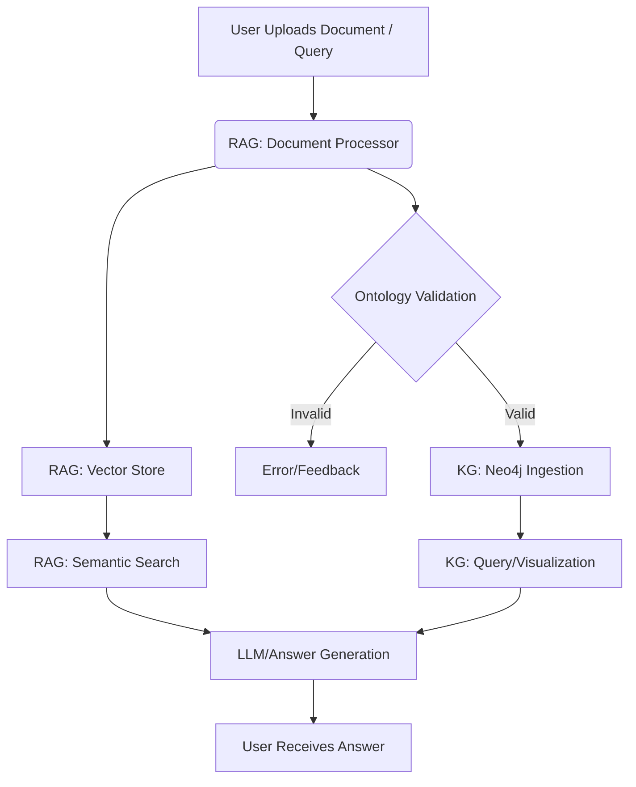

# HazardSafe-KG Architecture Overview

This document explains the working of the three core modules in HazardSafe-KG:
- Ontology
- RAG (Retrieval-Augmented Generation)
- Knowledge Graph (KG)

It describes their roles, workflows, and how they interact to enable structured analysis and intelligent processing of safety-relevant technical documents.

---

## 1. Ontology Module

### **Purpose**
- Defines the domain knowledge: classes, properties, relationships, constraints, and validation rules for hazardous substances, containers, and safety protocols.
- Supports multiple ontology formats: TTL, OWL, RDF/XML, JSON-LD, N-Triples, Notation3, TriG, SHACL.

### **Key Features**
- **CRUD Operations**: Create, read, update, and delete ontology entities (classes, properties, relationships).
- **Validation**: Uses SHACL shapes to validate data and ensure compliance with domain rules.
- **Format Conversion**: Import/export ontologies in various formats.
- **API & UI**: REST API endpoints and a web dashboard for ontology management.

### **Workflow**
1. **Load Ontology**: On startup, loads ontology files from the data directory.
2. **Validation**: Validates new data (e.g., substances, containers) against SHACL shapes.
3. **CRUD**: Users can manage ontology entities via API or UI.
4. **Export/Convert**: Ontologies can be exported or converted between supported formats.

---

## 2. RAG (Retrieval-Augmented Generation) Module

### **Purpose**
- Ingests technical documents (PDF, DOCX, TXT, JSON, etc.), extracts information, and stores it in structured JSON.
- Embeds document content for semantic search and retrieval.
- Answers user queries by retrieving relevant document chunks and generating responses.

### **Key Features**
- **Document Processor**: Extracts text and metadata from PDFs and other formats.
- **Vector Store**: Stores embeddings for semantic search (supports local, Pinecone, Weaviate, ChromaDB).
- **Query Engine**: Retrieves relevant content and augments LLM-based answers.
- **API & UI**: Upload documents, search, and query via API and dashboard.

### **Workflow**
1. **Ingestion**: User uploads a document (e.g., PDF). The processor extracts text and metadata.
2. **Storage**: Extracted content is stored as structured JSON. Embeddings are generated and stored in the vector database.
3. **Query**: User submits a question. The system retrieves relevant document chunks using semantic search.
4. **Generation**: Retrieved content is used to generate a contextual answer (optionally with LLMs).

---

## 3. Knowledge Graph (KG) Module

### **Purpose**
- Stores structured knowledge as a graph (nodes and relationships) in Neo4j.
- Enables complex querying, visualization, and reasoning over hazardous substances, containers, and safety data.

### **Key Features**
- **Neo4j Database**: Nodes (e.g., Substance, Container, Test), relationships (e.g., stored_in, tested_by).
- **Ingestion Pipeline**: Converts validated data into graph nodes/edges.
- **Query API**: Cypher-based queries for advanced search and analytics.
- **Visualization**: UI for exploring the knowledge graph.

### **Workflow**
1. **Ingestion**: Validated data (from CSV, JSON, or RAG extraction) is ingested as nodes and relationships.
2. **Query**: Users can run graph queries (e.g., "Find all containers compatible with sulfuric acid").
3. **Visualization**: Graph structure is visualized in the dashboard.

---

## 4. Module Interactions & Data Flow

- **Ontology** defines the schema and validation rules for both the KG and RAG modules.
- **RAG** extracts unstructured data, which can be validated and structured according to the ontology, then ingested into the KG.
- **KG** provides structured, queryable knowledge that can be referenced by the RAG system for more accurate retrieval and generation.

### **Example End-to-End Workflow**
1. **Upload**: User uploads a PDF safety data sheet.
2. **Extraction**: RAG module extracts text and metadata, stores as JSON, and generates embeddings.
3. **Validation**: Extracted data is validated against the ontology (SHACL shapes).
4. **Ingestion**: Validated data is ingested into the Neo4j knowledge graph.
5. **Query**: User asks, "What containers are suitable for storing sulfuric acid?"
6. **Retrieval**: RAG retrieves relevant document chunks; KG provides structured compatibility data.
7. **Answer Generation**: System combines retrieved info and graph data to generate a comprehensive answer.

---

## 5. Diagrams

### **High-Level Architecture**

---

## 6. References
- See `docs/ontology_formats.md` for supported ontology formats and best practices.
- See `data/rag/README.md` for RAG data structure and usage.
- Main project README for setup and running instructions. 