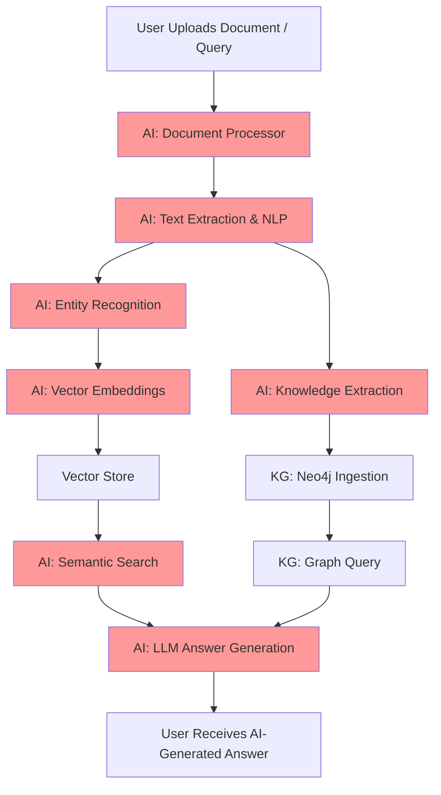
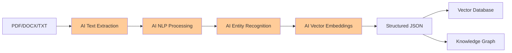

# HazardSafe-KG Architecture Overview

This document explains the working of the three core modules in HazardSafe-KG:
- Ontology
- RAG (Retrieval-Augmented Generation)
- Knowledge Graph (KG)

It describes their roles, workflows, and how they interact to enable structured analysis and intelligent processing of safety-relevant technical documents.

---

## 1. Ontology Module

### **Purpose**
- Defines the domain knowledge: classes, properties, relationships, constraints, and validation rules for hazardous substances, containers, and safety protocols.
- Supports multiple ontology formats: TTL, OWL, RDF/XML, JSON-LD, N-Triples, Notation3, TriG, SHACL.

### **Key Features**
- **CRUD Operations**: Create, read, update, and delete ontology entities (classes, properties, relationships).
- **Validation**: Uses SHACL shapes to validate data and ensure compliance with domain rules.
- **Format Conversion**: Import/export ontologies in various formats.
- **API & UI**: REST API endpoints and a web dashboard for ontology management.

### **Workflow**
1. **Load Ontology**: On startup, loads ontology files from the data directory.
2. **Validation**: Validates new data (e.g., substances, containers) against SHACL shapes.
3. **CRUD**: Users can manage ontology entities via API or UI.
4. **Export/Convert**: Ontologies can be exported or converted between supported formats.

---

## 2. RAG (Retrieval-Augmented Generation) Module

### **Purpose**
- Ingests technical documents (PDF, DOCX, TXT, JSON, etc.), extracts information, and stores it in structured JSON.
- Embeds document content for semantic search and retrieval.
- Answers user queries by retrieving relevant document chunks and generating responses.

### **Key Features**
- **Document Processor**: Extracts text and metadata from PDFs and other formats.
- **Vector Store**: Stores embeddings for semantic search (supports local, Pinecone, Weaviate, ChromaDB).
- **Query Engine**: Retrieves relevant content and augments LLM-based answers.
- **API & UI**: Upload documents, search, and query via API and dashboard.

### **Workflow**
1. **Ingestion**: User uploads a document (e.g., PDF). The processor extracts text and metadata.
2. **Storage**: Extracted content is stored as structured JSON. Embeddings are generated and stored in the vector database.
3. **Query**: User submits a question. The system retrieves relevant document chunks using semantic search.
4. **Generation**: Retrieved content is used to generate a contextual answer (optionally with LLMs).

---

## 3. Knowledge Graph (KG) Module

### **Purpose**
- Stores structured knowledge as a graph (nodes and relationships) in Neo4j.
- Enables complex querying, visualization, and reasoning over hazardous substances, containers, and safety data.

### **Key Features**
- **Neo4j Database**: Nodes (e.g., Substance, Container, Test), relationships (e.g., stored_in, tested_by).
- **Ingestion Pipeline**: Converts validated data into graph nodes/edges.
- **Query API**: Cypher-based queries for advanced search and analytics.
- **Visualization**: UI for exploring the knowledge graph.

### **Workflow**
1. **Ingestion**: Validated data (from CSV, JSON, or RAG extraction) is ingested as nodes and relationships.
2. **Query**: Users can run graph queries (e.g., "Find all containers compatible with sulfuric acid").
3. **Visualization**: Graph structure is visualized in the dashboard.

---

## 4. AI Technologies for Document Digitization and Analysis

### **Core AI Applications**

#### **Document Digitization**
- **PDF Text Extraction**: Uses AI-powered libraries (pdfplumber, PyPDF2) to extract text from complex PDF layouts
- **OCR Capabilities**: Can integrate with OCR services for scanned documents and images
- **Table Recognition**: AI algorithms to identify and extract tabular data from documents
- **Layout Analysis**: Intelligent parsing of document structure (headers, sections, footers)

#### **Natural Language Processing (NLP)**
- **Text Preprocessing**: Tokenization, lemmatization, and cleaning using NLTK
- **Entity Recognition**: Automatic extraction of chemical formulas, measurements, standards (OSHA, EPA, ASME)
- **Keyword Extraction**: AI-based identification of key topics and concepts
- **Sentiment Analysis**: Understanding document tone and urgency levels

#### **Semantic Understanding**
- **Vector Embeddings**: Converts text into high-dimensional vectors for semantic similarity
- **Semantic Search**: AI-powered retrieval of relevant document chunks based on meaning, not just keywords
- **Topic Modeling**: Automatic categorization of documents by content themes
- **Document Clustering**: Grouping similar documents for better organization

#### **Intelligent Query Processing**
- **Query Understanding**: Natural language processing to understand user intent
- **Context-Aware Retrieval**: AI algorithms that consider document context and relationships
- **Answer Generation**: LLM integration for generating human-like responses
- **Confidence Scoring**: AI-based assessment of answer reliability

#### **Knowledge Extraction**
- **Information Extraction**: AI algorithms to extract structured data from unstructured text
- **Relationship Discovery**: Automatic identification of connections between entities
- **Fact Validation**: AI-powered verification of extracted information against known facts
- **Knowledge Graph Population**: Automated creation of graph nodes and relationships

### **AI-Powered Features**

#### **Smart Document Processing**
```python
# Example: AI-powered document analysis
document_processor = DocumentProcessor()
result = document_processor.process_document("safety_data_sheet.pdf", "safety")

# AI extracts:
# - Chemical formulas (H2SO4, CH3COOH)
# - Measurements (100°C, 2.5 bar)
# - Safety standards (OSHA, EPA)
# - Key topics (corrosion, toxicity, flammability)
# - Entities and relationships
```

#### **Intelligent Search and Retrieval**
```python
# Example: Semantic search with AI
vector_store = VectorStore()
results = vector_store.search("What containers are suitable for sulfuric acid?")

# AI performs:
# - Query embedding generation
# - Semantic similarity matching
# - Context-aware ranking
# - Relevant chunk retrieval
```

#### **Automated Knowledge Graph Population**
```python
# Example: AI-driven knowledge extraction
extracted_data = {
    "substance": "Sulfuric Acid",
    "formula": "H2SO4",
    "hazards": ["corrosive", "toxic"],
    "compatible_containers": ["polyethylene", "stainless_steel"],
    "safety_standards": ["OSHA", "EPA"]
}

# AI automatically creates:
# - Substance node
# - Container nodes
# - Hazard relationships
# - Compliance relationships
```

### **AI Technology Stack**
- **Document Processing**: PyPDF2, pdfplumber, python-docx
- **NLP**: NLTK, spaCy (optional), transformers
- **Vector Embeddings**: OpenAI embeddings, sentence-transformers
- **Vector Databases**: Pinecone, Weaviate, ChromaDB, local storage
- **LLM Integration**: OpenAI GPT, local models (optional)
- **Knowledge Graph**: Neo4j with AI-powered population

---

## 5. Module Interactions & Data Flow

- **Ontology** defines the schema and validation rules for both the KG and RAG modules.
- **RAG** extracts unstructured data using AI, which can be validated and structured according to the ontology, then ingested into the KG.
- **KG** provides structured, queryable knowledge that can be referenced by the RAG system for more accurate retrieval and generation.

### **Example End-to-End AI Workflow**
1. **Upload**: User uploads a PDF safety data sheet.
2. **AI Extraction**: RAG module uses AI to extract text, metadata, entities, and relationships.
3. **AI Validation**: Extracted data is validated against the ontology using AI-powered validation.
4. **AI Ingestion**: Validated data is automatically ingested into the Neo4j knowledge graph.
5. **AI Query**: User asks, "What containers are suitable for storing sulfuric acid?"
6. **AI Retrieval**: RAG uses semantic search to retrieve relevant document chunks; KG provides structured compatibility data.
7. **AI Generation**: System combines retrieved info and graph data to generate a comprehensive answer using LLM.

---

## 6. Diagrams

### **High-Level Architecture with AI**



### **AI Document Processing Pipeline**



---

## 7. References
- See `docs/ontology_formats.md` for supported ontology formats and best practices.
- See `data/rag/README.md` for RAG data structure and usage.
- Main project README for setup and running instructions. 