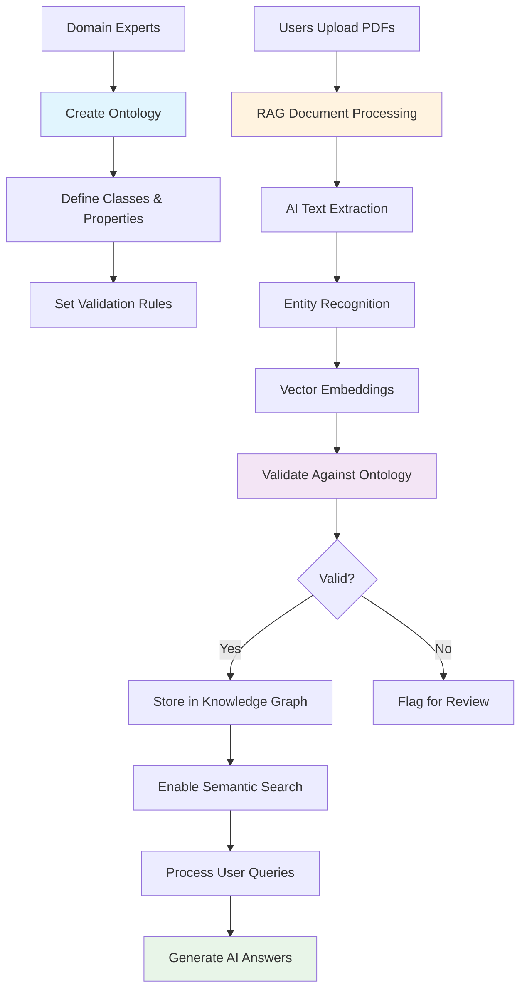

# Ontology vs RAG: Understanding the Framework Architecture

## **🏗️ Ontology (Knowledge Schema)**

### **What is Ontology?**
- **Definition**: A structured schema that defines **how knowledge should be organized**
- **Purpose**: Provides the **rules and structure** for representing domain knowledge
- **Source**: Manually created by domain experts, not from PDFs
- **Content**: Classes, properties, relationships, validation rules

### **Ontology Components**
```turtle
# Example: Chemical Substance Ontology
@prefix hs: <http://hazardsafe-kg.org/ontology#> .
@prefix rdf: <http://www.w3.org/1999/02/22-rdf-syntax-ns#> .
@prefix rdfs: <http://www.w3.org/2000/01/rdf-schema#> .

# Define classes
hs:ChemicalSubstance a rdfs:Class ;
    rdfs:label "Chemical Substance" ;
    rdfs:comment "A chemical substance with safety properties" .

hs:Container a rdfs:Class ;
    rdfs:label "Container" ;
    rdfs:comment "A container for storing chemical substances" .

# Define properties
hs:hasHazard a rdf:Property ;
    rdfs:domain hs:ChemicalSubstance ;
    rdfs:range hs:HazardType .

hs:isCompatibleWith a rdf:Property ;
    rdfs:domain hs:ChemicalSubstance ;
    rdfs:range hs:Container .
```

### **Ontology Features**
- ✅ **Pre-defined Structure**: Classes, properties, relationships
- ✅ **Validation Rules**: SHACL shapes for data validation
- ✅ **Domain Knowledge**: Expert-created safety standards
- ✅ **Multiple Formats**: TTL, OWL, RDF/XML, JSON-LD
- ❌ **No PDF Processing**: Not built from documents

---

## **📄 RAG (Document Processing & Query)**

### **What is RAG?**
- **Definition**: Retrieval-Augmented Generation for processing **actual documents**
- **Purpose**: Extracts information from PDFs and enables intelligent querying
- **Source**: PDFs, DOCX, TXT files uploaded by users
- **Content**: Extracted text, entities, relationships from documents

### **RAG Components**
```json
{
  "documents": [
    {
      "id": "doc_001",
      "title": "Sulfuric Acid Safety Data Sheet",
      "content": "Sulfuric acid (H2SO4) is a highly corrosive strong acid...",
      "source": "Chemical Safety Database",
      "type": "safety_data_sheet",
      "tags": ["corrosive", "acid", "sulfuric", "safety"],
      "metadata": {
        "chemical_formula": "H2SO4",
        "hazard_class": "corrosive",
        "container_material": "polyethylene"
      }
    }
  ]
}
```

### **RAG Features**
- ✅ **PDF Processing**: AI-powered text extraction
- ✅ **Entity Recognition**: Automatic extraction of chemical formulas, measurements
- ✅ **Semantic Search**: Vector-based similarity search
- ✅ **Query Processing**: Natural language understanding
- ✅ **Answer Generation**: LLM-powered responses
- ❌ **No Schema Definition**: Uses ontology for validation

---

## **🔄 How They Work Together**

### **1. Ontology Provides Structure**
```python
# Ontology defines the rules
ontology_rules = {
    "ChemicalSubstance": {
        "required_properties": ["formula", "hazard_class"],
        "validation_rules": ["formula_format", "hazard_classification"]
    }
}
```

### **2. RAG Processes Documents**
```python
# RAG extracts data from PDFs
pdf_content = "Sulfuric acid (H2SO4) is corrosive..."
extracted_data = {
    "formula": "H2SO4",
    "hazard_class": "corrosive",
    "source": "safety_data_sheet.pdf"
}
```

### **3. Validation Against Ontology**
```python
# Validate extracted data against ontology rules
validation_result = ontology_manager.validate_substance(extracted_data)
if validation_result["valid"]:
    # Store in knowledge graph
    knowledge_graph.add_substance(extracted_data)
```

### **4. Intelligent Querying**
```python
# User query
query = "What containers are suitable for sulfuric acid?"

# RAG finds relevant documents
relevant_docs = vector_store.search(query)

# Knowledge graph provides structured data
structured_data = knowledge_graph.get_compatibility("H2SO4")

# Generate comprehensive answer
answer = llm.generate_answer(query, relevant_docs, structured_data)
```

---

## **📊 Workflow Diagram**



---

## **🎯 Key Differences**

| Aspect | Ontology | RAG |
|--------|----------|-----|
| **Purpose** | Define knowledge structure | Process actual documents |
| **Source** | Expert-created | PDF/DOCX files |
| **Content** | Classes, properties, rules | Extracted text, entities |
| **Format** | TTL, OWL, RDF/XML | JSON documents, vectors |
| **AI Usage** | Validation rules | Text extraction, NLP |
| **Updates** | Manual by experts | Automatic from documents |

---

## **💡 Summary**

- **Ontology** = The **blueprint** (how knowledge should be organized)
- **RAG** = The **processor** (extracts and queries actual documents)
- **Together** = Complete AI-powered knowledge management system

The framework uses **both**:
1. **Ontology** to define the structure and validation rules
2. **RAG** to process PDFs and extract information according to those rules
3. **AI** to bridge the gap between unstructured documents and structured knowledge 